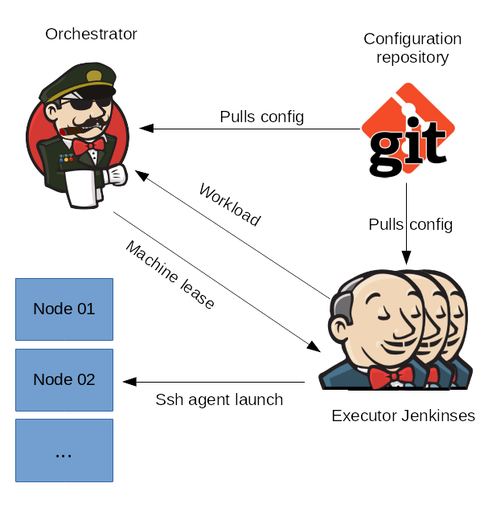

# Node Sharing for Jenkins

Share machines as Jenkins agents across multiple Jenkins masters.

https://plugins.jenkins.io/node-sharing-executor/

## Architecture

The configuration of the grid is offloaded into a git repository from where both
Orchestrator and Executor pulls the configuration.

